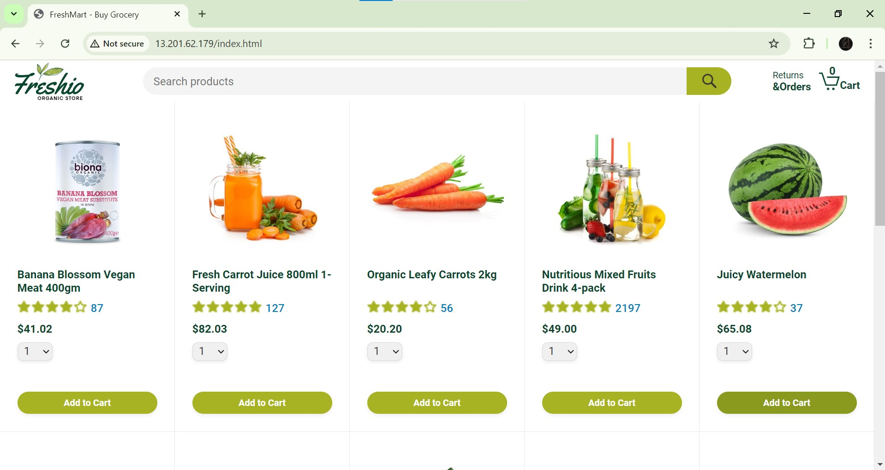
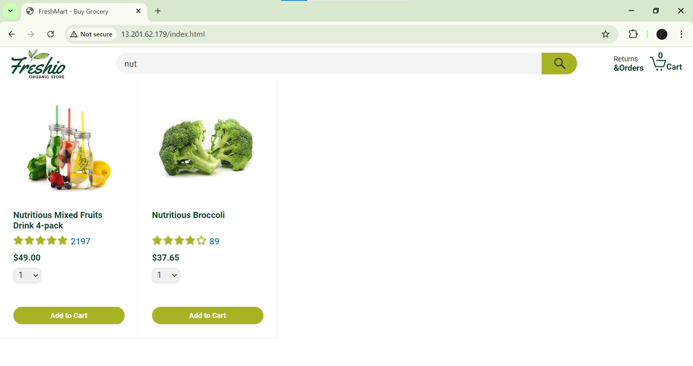
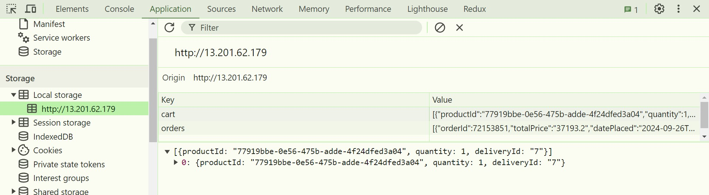
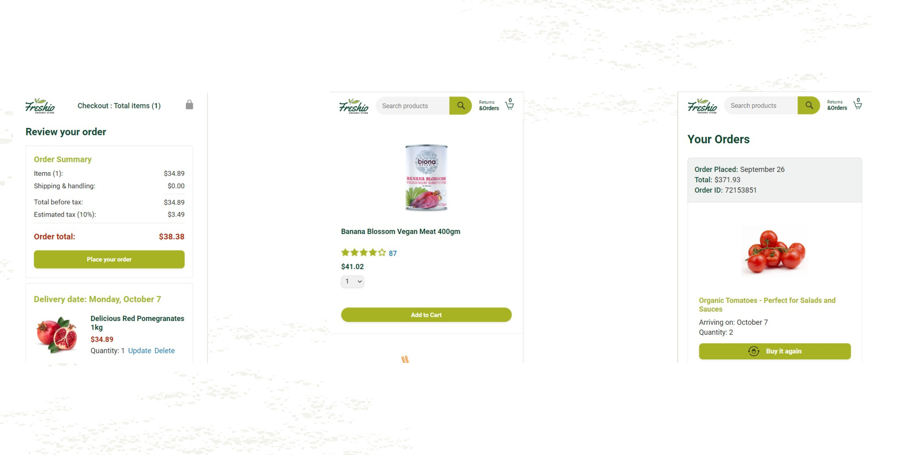

# 🍏 FreshMart



## 📝 Overview

FreshMart is an e-commerce website specializing in organic fruits and vegetables. This project is built using HTML, CSS, vanilla JavaScript. It incorporates three pages. The website also includes filtering and searching functionalities and has been designed with a responsive layout for optimal viewing on various devices.

## ✨ Features

### 🔍 Filtering and Searching
Efficient product filtering and searching capabilities for a seamless shopping experience.



### 💾 Local Storage for Cart and User Preferences
Utilizes local storage to save user cart data and order details.



### 📱 Responsive Design
A responsive layout that ensures a seamless experience across desktop and mobile devices.



## 🛠️ Tech Stack

- **Frontend:** HTML, CSS, JavaScript

## 🚀 Like it ?

1. Clone the repository:

Use the following command to clone the repository to your local machine.


 ```bash
   git https://github.com/httpsanuj1807/WebProjectUCA.git
   ```
  
2. Open the WebProjectUCA folder with vscode or any IDE of your choice. Use live server to run the project on localhost and visit browser.

   
## 🌎 Contact

[](https://github.com/httpsanuj1807)
[](https://www.linkedin.com/in/anuj-kumar-7837a9268)
[](https://www.instagram.com/https_anuj1807)